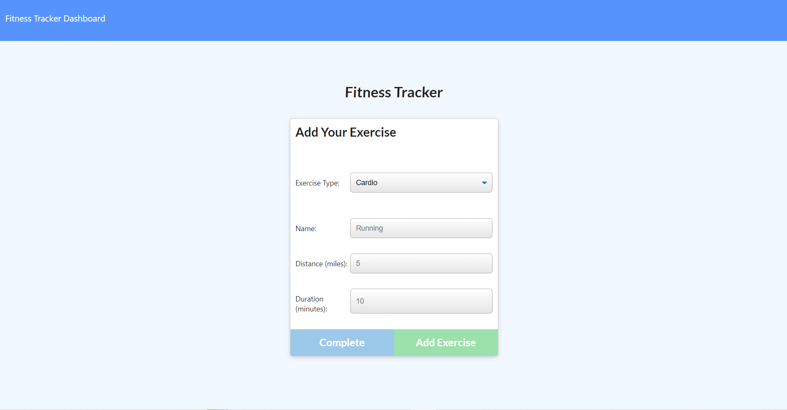

# fitness-tracker

## Table of Contents
* [Description](#Description)
* [Links](#Links)
* [Design Elements](#Design-Elements)
* [App Preview](#App-Preview)
* [Credits](#Credits)

## Description
This is an app that tracks all of your workout needs in one place. You can create new workout plans, continue existing workout plans, add/update exercises within workout plans, and even view statistics on your workout plans. This app will enable you to spend more of your time on reaching your fitness goals and less of your time on spreadsheets.

## Links
* Website: https://fitness-tracker-zachdrummond.herokuapp.com/
* GitHub Repository: https://github.com/zachdrummond/fitness-tracker

## Design Elements
* JavaScript
* Node.js
* Express.js
* Mongoose.js
* MongoDB
* Node Package Manager - Compression, Morgan, Lite-Server
* Model View Controller Architecture
* HTML
* CSS

## App Preview

## Credits
* https://nodejs.org/en/
* http://expressjs.com/
* https://www.mongodb.com/
* https://mongoosejs.com/
* https://www.npmjs.com/
* https://www.npmjs.com/package/nodemon
* https://www.npmjs.com/package/morgan
* https://www.heroku.com/